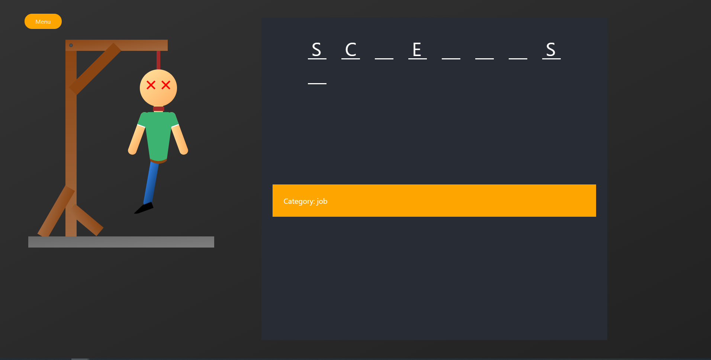

<p align="center">
 
</p>
<h1 align="center">
  Hangman
</h1>


***"Hangman"*** is a React app with data base on firebase. My first own react app.

This app is a hangman game. User use keys on keyboard to enter single letters.
Each word has assigned category. All words are stored in data base on firebase.
When we click play app get words from firebase and takes random word. 
***

###Demo screenshots





***
###Technologies
1. ReactJS
1. Styled Components
1. Firebase real time database
***

###Opening project


1.  **Start developing.**

    Navigate into your new site’s directory and start it up.

    ```shell
    cd hangman
    npm start
    ```


    
  ***

###Project structure

A quick look at the top-level files and directories you'll see in a Gatsby project.

    .
    ├── node_modules
    ├── public
    ├── src
        ├── Hangman
        ├── img
        ├── PlayingField
        ├── Popup
        ├── Starter
        ├── WordsField
        ├── App.css
        ├── App.js
        ├── axios.js
        ├── index.css
        ├── index.js
        ├── ServiceWorker.js
    ├── package.json
    ├── package-lock.json
    ├── README.md
    └── .gitignore


  
 
    
